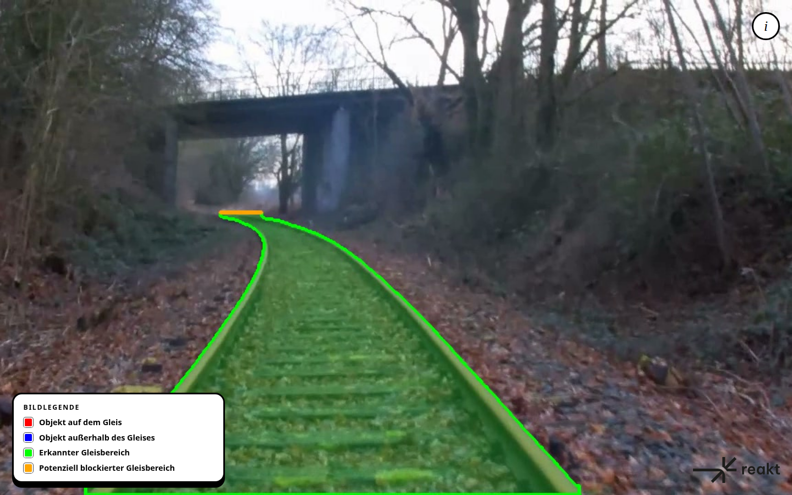

# ReaktRailAi (English)

ReaktRailAi processes the RTSP stream of a front-facing camera with a single
YOLO segmentation model. The model marks the drivable track area and detected
objects. The pipeline publishes the processed video as a WebRTC stream and
displays it with status information in a web interface.



> ReaktRailAi is a research and demonstration system. It is not a certified
> driver assistance or braking system.

## Repository contents

This repository contains the inference pipeline, the ready-to-use unified
YOLO26m segmentation model, Docker environments for NVIDIA, Jetson and AMD,
the web interface, and a tool for creating and correcting segmentation labels.

Videos, training datasets, test material and other recordings are not included
because of license and privacy restrictions.

## Quick start with Docker Compose

You need Docker with Compose support and a working GPU container runtime.
NVIDIA desktop GPUs require the NVIDIA Container Toolkit. On Jetson, use
Docker from the corresponding JetPack installation.

1. Clone the repository and change into its directory.
2. Create a local configuration:

   ```bash
   cp .env.example .env
   ```

   On a Jetson with JetPack 7, you can use the supplied preset instead:

   ```bash
   cp jetson.env .env
   ```

3. Set at least `CAMERA_RTSP_URL` and the appropriate hardware profile in
   `.env`. The required model is already included.
4. Build and start the containers:

   ```bash
   docker compose up -d --build
   ```

The four interface variants are then available at:

- `http://localhost:8080` – Dark
- `http://localhost:8081` – Light
- `http://localhost:8082` – REAKT
- `http://localhost:8083` – Sunlight

The first start with `MODEL_FORMAT=tensorrt` can take considerably longer:
the PT model is exported to a TensorRT engine for the target GPU and cached
in the `reaktrailai-model-cache` Docker volume.

For example, follow the active AI service logs with:

```bash
docker compose logs -f ai-cuda
```

To stop and remove the containers:

```bash
docker compose down
```

This does not delete the model or local results directories. The TensorRT
cache also remains in its named Docker volume.

## Hardware profiles

Select exactly one AI service with `COMPOSE_PROFILES`:

| Value | Target system | Typical mode |
|---|---|---|
| `cuda` | NVIDIA GPU on x86-64 | TensorRT FP16 or PyTorch FP16 |
| `rocm` | AMD GPU on x86-64 | PyTorch FP16/FP32 or ONNX |
| `jetpack5` | Jetson with JetPack 5 / Linux R35 | TensorRT FP16 |
| `jetpack6` | Jetson with JetPack 6 / Linux R36 | TensorRT FP16 |
| `jetpack7` | Jetson with JetPack 7 / Linux R39 | TensorRT FP16 |

> **Note:** The JetPack 5 and JetPack 6 profiles have not been tested and
> are unlikely to work as provided.

Example for a Jetson with JetPack 7:

```dotenv
COMPOSE_PROFILES=jetpack7
DEVICE=cuda:0
MODEL_FORMAT=tensorrt
MODEL_PRECISION=fp16
INPUT_DECODER=nvv4l2
WEBRTC_ENCODER=nvv4l2
```

On the Jetson host, increase the UDP receive buffer limit to 4 MiB before
starting the containers. MediaMTX requests this size through
`RTP_BUFFER_BYTES=4194304` but is limited by the host's `net.core.rmem_max`.
Save the setting under `/etc/sysctl.d/` so it also applies after a reboot:

```bash
printf 'net.core.rmem_max = 4194304\n' | sudo tee /etc/sysctl.d/99-reaktrailai-udp.conf
sudo sysctl -p /etc/sysctl.d/99-reaktrailai-udp.conf
```

Host and container must use the same JetPack generation. TensorRT engines
depend on the hardware and should be generated on the target device. See
[JETSON-START.md](JETSON-START.md) for a short JetPack 7 guide.

## Configuration

Runtime options can be set in `.env`, as environment variables, or as CLI
arguments when starting the application directly. The complete reference,
including valid values and defaults, is in [PARAMETERS.md](PARAMETERS.md).

The main settings are:

```dotenv
CAMERA_RTSP_URL=rtsp://camera.example:8554/input
MODEL_PATH=./model/reaktrailai-yolo26m-seg.pt
COMPOSE_PROFILES=cuda
MODEL_FORMAT=tensorrt
MODEL_PRECISION=fp16
OBJECT_CONFIDENCE=0.15
RAIL_CONFIDENCE=0.25
OBJECT_HOLD_SECONDS=1.0
```

## Labeling tool

The tool is kept separate from the runtime in
[`labeling-tool/`](labeling-tool/). It can preselect difficult video frames,
generate initial YOLO segmentation masks and let you edit them in a browser.
Installation, usage, keyboard shortcuts and export are documented in
[`labeling-tool/README.md`](labeling-tool/README.md).

## Model training

We trained the bundled [`reaktrailai-yolo26m-seg.pt`](model/README.md) as a
single Ultralytics YOLO26m segmentation model for both objects and drivable
track areas. We started from the official COCO-pretrained YOLO26m segmentation
model and adapted its head from 80 to 81 classes: the 80 COCO object classes
and `rail` as class 80.

For training, we combined 118,287 [COCO 2017](https://cocodataset.org/#download)
images with their original object masks and added rail pseudo-labels, 7,225
[RailSem19](https://wilddash.cc/railsem19) images with track-area masks and
added object pseudo-labels, and 134 manually confirmed review images. We
included each review image 20 times in the training list. This produced
128,192 training entries from 125,646 distinct images. For validation, we
kept 5,000 COCO, 1,275 RailSem19 and 34 review images separate: 6,309 images
in total. The added pseudo-labels were generated automatically; they are not
manually verified ground truth.

The source datasets have different usage terms. [COCO's terms of
use](https://cocodataset.org/#termsofuse) license its annotations under
CC BY 4.0; the COCO consortium does not own the images, whose use is subject
to Flickr's terms and the respective image rights. The [RailSem19 license
agreement](https://wilddash.cc/license/railsem19) places its intensity images
under CC BY-NC 4.0 and dense metadata under CC BY-NC-SA 4.0. Its sparse
metadata may not be redistributed without AIT's prior written consent; access
and use are also limited by the agreement's research and registration terms.
We therefore do not include the source datasets or the data-filled training
package in this release. Review recordings are also omitted for privacy.

| Training setting | Value |
|---|---|
| Input size | 640 × 640 pixels |
| Batch size | 12 for training and validation |
| Epochs | Maximum 300 configured; training ended after 35 epochs |
| Early stopping | Patience 25 |
| Optimizer and learning rate | AdamW, initial learning rate `0.0002`, cosine schedule, final learning rate factor `0.05` |
| Weight decay and warm-up | `0.0005`; 1 epoch |
| Precision and masks | AMP enabled; `overlap_mask=false`, `mask_ratio=4` so overlapping track instances retain separate masks |
| Augmentation | Mosaic `0.2`, copy-paste `0.1`, mixup `0`, rotation `2°`, translation `0.05`, scale `0.2`, horizontal flip `0.5`; `close_mosaic=3` |
| Reproducibility | Seed `260830`, deterministic training enabled, 0 data-loader workers |

We used 640 × 640 pixels for training and as the pipeline's default inference
size. The confidence thresholds in the runtime configuration apply during
inference; they were not training hyperparameters.

## Possible future development

- Collect and manually verify more track scenes, especially switches,
  occlusions, distant objects, night, rain and glare; keep independent test
  routes separate from training and validation.
- Compare new checkpoints on both track masks and object classes, including
  per-class errors and temporal gaps, before replacing the bundled model.
- Improve temporal consistency and track selection around switches, and
  measure how these changes affect false warnings and missed objects.
- Benchmark FP16 and calibrated INT8 on the target NVIDIA, Jetson and AMD
  hardware, recording accuracy as well as latency and stream stability.

## Project structure

```text
ReaktRailAi/
├── compose.yaml          # production container stack
├── docker/               # runtime images and WebRTC configuration
├── labeling-tool/        # standalone label editor
├── model/                # unified YOLO26m segmentation model
├── requirements/         # platform-specific Python dependencies
├── src/rail_ai/          # inference pipeline and API
├── tools/                # runtime diagnostics and JetPack 7 patch
└── webui/                # browser-based stream interface
```

## License and third-party material

ReaktRailAi is published under the [GNU Affero General Public License,
version 3](LICENSE) (`AGPL-3.0`). It applies to the project as a whole unless
individual files or third-party material explicitly state otherwise. The
bundled Ultralytics checkpoint also records `AGPL-3.0` in its metadata. See
the [Ultralytics license overview](https://www.ultralytics.com/license) for
more information.

Trademarks, names and third-party material remain the property of their
respective owners. Notes on the ReAKT logo and UI assets are in
[`webui/assets/README.md`](webui/assets/README.md).

# ReaktRailAi (Deutsch)

ReaktRailAi verarbeitet den RTSP-Stream einer Frontkamera mit einem einzigen
YOLO-Segmentierungsmodell. Das Modell markiert den befahrbaren Gleisbereich und
erkannte Objekte. Die Pipeline bereitet das Ergebnis als WebRTC-Stream auf und
stellt es zusammen mit Statuswerten in einer Weboberfläche dar.


> ReaktRailAi ist ein Forschungs- und Demonstrationssystem. Es ist kein
> sicherheitszertifiziertes Fahrerassistenz- oder Bremssystem.

## Inhalt dieses Repositorys

Enthalten sind der Quellcode der Inferenzpipeline, das einsatzbereite einheitliche
YOLO26m-Segmentierungsmodell, Docker-Umgebungen für NVIDIA, Jetson und AMD, die
Weboberfläche und ein Werkzeug zur Erstellung und
Korrektur von Segmentierungslabels.

Videos, Trainingsdatensätze, Testmaterial und andere Aufzeichnungen sind
aufgrund von Lizenz- und Datenschutzbestimmungen nicht enthalten.


## Schnellstart mit Docker Compose

Vorausgesetzt werden Docker mit Compose-Unterstützung und eine funktionsfähige
GPU-Container-Laufzeit. Für NVIDIA-Desktop-GPUs wird das NVIDIA Container Toolkit
benötigt; auf einem Jetson muss Docker aus der jeweiligen JetPack-Installation
verwendet werden.

1. Repository klonen und in den Ordner wechseln.
2. Lokale Konfiguration anlegen:

   ```bash
   cp .env.example .env
   ```

   Auf einem Jetson mit JetPack 7 kann stattdessen die fertige Voreinstellung
   verwendet werden:

   ```bash
   cp jetson.env .env
   ```

3. In `.env` mindestens `CAMERA_RTSP_URL` und das passende Hardwareprofil
   anpassen. Das benötigte Modell ist bereits enthalten.
4. Container bauen und starten:

   ```bash
   docker compose up -d --build
   ```

Danach sind die vier Darstellungsvarianten unter folgenden Adressen erreichbar:

- `http://localhost:8080` – Dark
- `http://localhost:8081` – Light
- `http://localhost:8082` – REAKT
- `http://localhost:8083` – Sonnenlicht

Der erste Start mit `MODEL_FORMAT=tensorrt` kann deutlich länger dauern, weil aus
dem PT-Modell zunächst ein zur jeweiligen GPU passendes TensorRT-Engine erzeugt
und im Docker-Volume `reaktrailai-model-cache` zwischengespeichert wird.

Logs des aktiven AI-Dienstes zeigt beispielsweise:

```bash
docker compose logs -f ai-cuda
```

Zum Stoppen und Entfernen der Container:

```bash
docker compose down
```

Das Modell und lokale Ergebnisordner werden dadurch nicht gelöscht. Auch der
TensorRT-Cache bleibt als benanntes Docker-Volume erhalten.

## Hardwareprofile

Über `COMPOSE_PROFILES` wird genau ein AI-Dienst ausgewählt:

| Wert | Zielsystem | typischer Modus |
|---|---|---|
| `cuda` | NVIDIA-GPU auf x86-64 | TensorRT FP16 oder PyTorch FP16 |
| `rocm` | AMD-GPU auf x86-64 | PyTorch FP16/FP32 oder ONNX |
| `jetpack5` | Jetson mit JetPack 5 / Linux R35 | TensorRT FP16 |
| `jetpack6` | Jetson mit JetPack 6 / Linux R36 | TensorRT FP16 |
| `jetpack7` | Jetson mit JetPack 7 / Linux R39 | TensorRT FP16 |

> **Hinweis:** Die Profile für JetPack 5 und JetPack 6 sind ungetestet und
> funktionieren in der vorliegenden Fassung vermutlich nicht.

Beispiel für einen Jetson mit JetPack 7:

```dotenv
COMPOSE_PROFILES=jetpack7
DEVICE=cuda:0
MODEL_FORMAT=tensorrt
MODEL_PRECISION=fp16
INPUT_DECODER=nvv4l2
WEBRTC_ENCODER=nvv4l2
```

Auf dem Jetson-Host sollte vor dem Containerstart das Limit für den
UDP-Empfangspuffer auf 4 MiB erhöht werden. MediaMTX fordert mit
`RTP_BUFFER_BYTES=4194304` diese Größe an, wird aber durch das Hostlimit
`net.core.rmem_max` begrenzt. Die Einstellung unter `/etc/sysctl.d/` bleibt
auch nach einem Neustart erhalten:

```bash
printf 'net.core.rmem_max = 4194304\n' | sudo tee /etc/sysctl.d/99-reaktrailai-udp.conf
sudo sysctl -p /etc/sysctl.d/99-reaktrailai-udp.conf
```

Host und Container müssen dieselbe JetPack-Generation verwenden. TensorRT-Engines
sind hardwarespezifisch und sollten auf dem Zielgerät neu erzeugt werden.
Eine kompakte JetPack-7-Anleitung steht in [JETSON-START.md](JETSON-START.md).

## Konfiguration

Alle Laufzeitoptionen können in `.env`, als Umgebungsvariablen oder beim direkten
Start als CLI-Argumente gesetzt werden. Die vollständige Referenz mit gültigen
Werten und Standardwerten steht in [PARAMETERS.md](PARAMETERS.md).

Die wichtigsten Einstellungen sind:

```dotenv
CAMERA_RTSP_URL=rtsp://camera.example:8554/input
MODEL_PATH=./model/reaktrailai-yolo26m-seg.pt
COMPOSE_PROFILES=cuda
MODEL_FORMAT=tensorrt
MODEL_PRECISION=fp16
OBJECT_CONFIDENCE=0.15
RAIL_CONFIDENCE=0.25
OBJECT_HOLD_SECONDS=1.0
```

## Labeling-Werkzeug

Das Werkzeug befindet sich bewusst getrennt von der Laufzeit unter
[`labeling-tool/`](labeling-tool/). Es kann schwierige Videoframes vorselektieren,
YOLO-Segmentierungsmasken vorlabeln und diese anschließend im Browser bearbeiten.
Installation, Bedienung, Tastenkürzel und Export sind in
[`labeling-tool/README.md`](labeling-tool/README.md) beschrieben.

## Modelltraining

Wir haben das mitgelieferte Modell
[`reaktrailai-yolo26m-seg.pt`](model/README.md) als einheitliches
Ultralytics-YOLO26m-Segmentierungsmodell für Objekte und befahrbare
Gleisbereiche trainiert. Ausgangspunkt war das offizielle, auf COCO
vortrainierte YOLO26m-Segmentierungsmodell. Seinen Kopf haben wir von 80 auf
81 Klassen angepasst: die 80 COCO-Objektklassen und `rail` als Klasse 80.

Für das Training kombinierten wir 118.287 Bilder aus
[COCO 2017](https://cocodataset.org/#download) mit ihren originalen
Objektmasken und ergänzten Gleis-Pseudolabels, 7.225 Bilder aus
[RailSem19](https://wilddash.cc/railsem19) mit Gleisbereichsmasken und
ergänzten Objekt-Pseudolabels sowie 134 manuell bestätigte Review-Bilder.
Jedes Review-Bild stand 20-mal in der Trainingsliste. So entstanden 128.192
Trainingseinträge aus 125.646 verschiedenen Bildern. Für die Validierung
hielten wir 5.000 COCO-, 1.275 RailSem19- und 34 Review-Bilder getrennt:
insgesamt 6.309 Bilder. Die ergänzten Pseudolabels wurden automatisch
erzeugt; sie sind keine manuell geprüfte Ground Truth.

Für die Quelldatensätze gelten unterschiedliche Nutzungsbedingungen. Die
[COCO-Nutzungsbedingungen](https://cocodataset.org/#termsofuse) stellen die
Annotationen unter CC BY 4.0. Die Bilder gehören nicht dem COCO-Konsortium;
für sie gelten die Flickr-Bedingungen und die jeweiligen Bildrechte. Laut
[RailSem19-Lizenzvereinbarung](https://wilddash.cc/license/railsem19) stehen
die Intensitätsbilder unter CC BY-NC 4.0 und die dichten Metadaten unter
CC BY-NC-SA 4.0. Sparse Metadaten dürfen ohne vorherige schriftliche
Zustimmung des AIT nicht weitergegeben werden; außerdem gelten die
Forschungs- und Registrierungsvorgaben der Vereinbarung. Deshalb enthält
dieser Release weder die Quelldatensätze noch das mit Daten befüllte
Trainingspaket. Review-Aufnahmen fehlen auch aus Datenschutzgründen.

| Trainingseinstellung | Wert |
|---|---|
| Eingabegröße | 640 × 640 Pixel |
| Batchgröße | 12 für Training und Validierung |
| Epochen | Maximal 300 konfiguriert; das Training endete nach 35 Epochen |
| Early Stopping | Patience 25 |
| Optimierer und Lernrate | AdamW, anfängliche Lernrate `0.0002`, Kosinusverlauf, Endfaktor der Lernrate `0.05` |
| Weight Decay und Warm-up | `0.0005`; 1 Epoche |
| Präzision und Masken | AMP aktiviert; `overlap_mask=false`, `mask_ratio=4`, damit überlappende Gleisinstanzen getrennte Masken behalten |
| Augmentierung | Mosaic `0.2`, Copy-Paste `0.1`, Mixup `0`, Rotation `2°`, Translation `0.05`, Skalierung `0.2`, horizontale Spiegelung `0.5`; `close_mosaic=3` |
| Reproduzierbarkeit | Seed `260830`, deterministisches Training aktiviert, 0 Data-Loader-Worker |

Wir verwendeten 640 × 640 Pixel für das Training und als Standardbildgröße
der Inferenzpipeline. Die Konfidenzschwellen der Laufzeitkonfiguration gelten
bei der Inferenz; sie waren keine Trainingshyperparameter.

## Mögliche Weiterentwicklung

- Mehr Gleisszenen sammeln und manuell prüfen, insbesondere Weichen,
  Verdeckungen, entfernte Objekte, Nacht, Regen und Blendung. Unabhängige
  Teststrecken von Training und Validierung getrennt halten.
- Neue Checkpoints sowohl für Gleismasken als auch für Objektklassen
  vergleichen, einschließlich Fehlern je Klasse und zeitlichen Ausfällen,
  bevor das mitgelieferte Modell ersetzt wird.
- Zeitliche Stabilität und Gleisauswahl an Weichen verbessern und die
  Auswirkungen auf Fehlwarnungen und übersehene Objekte messen.
- FP16 und kalibriertes INT8 auf den vorgesehenen NVIDIA-, Jetson- und
  AMD-Geräten vergleichen und neben der Genauigkeit auch Latenz und
  Streamstabilität erfassen.

## Projektstruktur

```text
ReaktRailAi/
├── compose.yaml          # produktiver Container-Stack
├── docker/               # Laufzeitimages und WebRTC-Konfiguration
├── labeling-tool/        # eigenständiger Label-Editor
├── model/                # einheitliches YOLO26m-Segmentierungsmodell
├── requirements/         # Python-Abhängigkeiten der Plattformen
├── src/rail_ai/          # Inferenzpipeline und API
├── tools/                # Laufzeitdiagnose und JetPack-7-Patch
└── webui/                # browserbasierte Stream-Oberfläche
```

## Lizenz und Fremdmaterial

ReaktRailAi wird unter der [GNU Affero General Public License Version 3](LICENSE)
(`AGPL-3.0`) veröffentlicht. Die Lizenz gilt für das gesamte Projekt, soweit
einzelne Dateien oder Fremdmaterialien nicht ausdrücklich abweichend
gekennzeichnet sind. Der mitgelieferte Ultralytics-Checkpoint weist ebenfalls
`AGPL-3.0` in seinen Metadaten aus. Weitere Informationen bietet die
[Ultralytics-Lizenzübersicht](https://www.ultralytics.com/license).

Marken, Namen und Fremdmaterialien bleiben Eigentum ihrer jeweiligen
Rechteinhaber. Hinweise zum ReAKT-Logo und zu den UI-Assets stehen in
[`webui/assets/README.md`](webui/assets/README.md).
